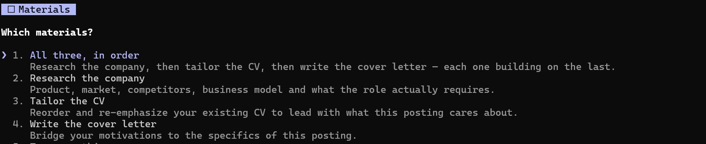

# PMFitFrame

PMFitFrame is a Claude Code assistant which supports PMs in the pursuit of their next role.


All it takes is to give it your CV, you then help it to quickly establish your preferences and competencies (according to Ravi Mehta framework) and from then on it scales  your job pursuit. 

It screens roles against what you actually said you want, writes honest role fit assessment, tailors the CV, drafts the letters, preps you the interview, and keeps a pipeline board published as claude html artifact to keep you organized.


<!-- SCREENSHOT: the pipeline board artifact, full page -->


---

## Why this exists

Generic AI job search help fails in three predictable ways. It flatters. It forgets. And it invents.

This project is built to fail differently:

| Failure mode | What stops it here |
| --- | --- |
| Flattery | Every fit assessment carries an **Honest Gap Assessment** table and a verdict that is allowed to be "do not apply". A stated hard requirement you do not meet ends the assessment cleanly rather than getting talked around. |
| Forgetting | `pm-profile/` is the source of truth about you; `job-pipeline/` is the working state. Both live on disk. Every skill reads them fresh rather than trusting the conversation. |
| Inventing | `tailor-resume` and `cover-letter` may reorder, reframe and drop. They may not add. If the posting wants something your CV does not show, you get asked, not written around. |

---

## Quick start

1. **Get Claude Code.** This repo is a Claude Code project, not a standalone tool.
2. **Clone it and open a session in the project root.**
   ```bash
   git clone <this-repo> PMFitFrame
   cd PMFitFrame
   claude
   ```
3. **Start the conversation.** Say anything — `hi`, a question, or jump straight to sharing a CV. This triggers the boot protocol, which shows you the welcome line if no CV is on file, or the menu if one exists.
4. **Give it your CV.** A path, an attachment, or pasted text. PDF, DOCX, DOC, Pages, RTF, TXT or MD all work.
   ```
   > C:\path\to\my_resume.pdf
   ```
   It extracts the text and saves `pm-profile/cv.md` plus the original.
5. **Review your competencies.** The system analyzes your CV against the Ravi Mehta framework (12 competencies across 4 areas), presents its findings, and asks you to validate or adjust. Based on your CV + demonstrated competencies, it deduces your seniority level. This builds `pm-profile/competencies.md` (with both your level and competencies assessment).
And that's the whole onboarding!

From then on you are taken through the options:
<!-- SCREENSHOT: main menu-->


Where Building application materials presents you with following:
<!-- SCREENSHOT: Build application materials -->

---

## How a session starts

A `SessionStart` hook (`.claude/boot.sh`) checks `pm-profile/` in shell **before** Claude answers anything, and injects the result into context. The branch is decided by code, not by model judgement, so the first response is deterministic:

- **No CV on file** → you get one line asking for a CV, and nothing else. No menu, no skills, no advice on a profile that does not exist.
- **CV on file** → you get what is on file by filename, one line on anything missing (competencies assessment, preferences, etc.), then a picker to choose what to do. Open with a real request instead — a pasted posting, "research Acme" — and you get the work, not the picker.

**What gets built during onboarding:**
- `cv.md` — canonical CV text (created by `cv-intake`)
- `competencies.md` — your seniority level (deduced by `competencies` skill based on CV + demonstrated competencies) and your 12-competency assessment against the Ravi Mehta framework (created by `competencies` skill after `cv-intake`)
- `preferences.md` — your comp floor, role preferences, deal-breakers (filled in with you, optional)


A bare number still works if you type one, and so does "where do things stand", "should I apply to this", or a pasted posting.

The picker carries four grouped choices — pipeline, assess a role, build application materials, interview prep — with the materials group drilling down to research / tailor / cover letter / all three, because the tool caps a question at four options. `menu` (or "what now", "not sure") brings it back mid-session. It never appears in front of a request you have already made clearly.

---

## The skills

Eight skills in `.claude/skills/`. Six are menu options; `cv-intake` fires whenever you supply a CV, and `pipeline-artifacts` is invoked by the others.

| Skill | Triggered by | What it produces |
| --- | --- | --- |
| **cv-intake** | Supplying a CV in any form | `pm-profile/cv.md` (canonical text), `cv-original.<ext>` (verbatim), and `level.md` (your `<level-slug>`, deduced from titles and described scope). Sanity-checks extraction before saving. Then invokes **competencies** skill automatically. |
| **competencies** | After `cv-intake` during onboarding, or anytime you want to update | `pm-profile/competencies.md`: your assessment against the Ravi Mehta 12-competency framework (Product Execution, Customer Insight, Product Strategy, Influencing People). Extracts evidence from your CV, presents findings with rationale, asks you to validate or adjust. Captures calibration notes. Invokable anytime you gain new skills/scope. |
| **job-pipeline** | `1`, "where do things stand", or news on a role | The index and role files under `job-pipeline/`. Owns one status vocabulary, and derives the table from the status so a rejected role cannot sit in Active. |
| **role-fit** | `2`, a pasted posting, "should I apply" | `fit-assessment.md`: role deconstruction, preference screen, dimension-by-dimension fit (grounded in your level + competencies), honest gaps, bridging language, verdict. The foundation document every other skill reads first. |
| **company-research** | `3`, "research this company" | `company-product-analysis.md`: product, market, competitors, business model, org signals. Enough to answer "tell me about our product" in an interview. |
| **tailor-resume** | `4`, "tailor my CV" | `cv.md` in the company folder. Reorders and reframes. Never invents. |
| **interview-prep** | `6`, "mock interview" | Mode A: a calibrated prep doc per stage, published as its own page. Mode B: a live turn-by-turn mock where you answer and get graded against a senior bar. Both run off a book you supply — see below. |
| **cover-letter** | `5`, "write the cover letter" | `cover-letter.md`, five-part structure, gaps named directly rather than buried. |
| **pipeline-artifacts** | Another skill needing a refresh | The published pages: one per role document, plus the board that links them all. |

### The interview question book

`interview-prep` does not invent questions from memory. It reads a **book**: one or more interview guides in `.claude/skills/interview-prep/docs/`, extracted to markdown with `<!-- page N -->` markers, which supply both the question bank and the grading rubric. Everything it asks you should be traceable to a page you can go and read.

- **What ships:** *The Heap Book of Questions*, a free interview question guide. That is the default bank, and it is what the skill cites unless you change it.
- **What does not ship:** this project was originally built against *Cracking the PM Interview* (McDowell & Bavaro) and *Decode & Conquer* (Lewis Lin). Both are paid books, so no copy or condensation of them is in this repo. If you own them, extract them yourself and the skill picks them up.
- **Any book works.** The library is whatever `.md` files are in `docs/` at the time. Drop another extracted guide in — PM, engineering, design, sales, whatever your field is — and it becomes the source with no change to the skill. A PDF alone is not enough: ask for it to be extracted first, or the skill will tell you it is there but unusable.
- **Empty `docs/` still runs**, on the rubric written into the skill, and it says so rather than pretending a bank exists. The questions are noticeably more generic.

### What the skills refuse to do

- `role-fit` will not soften a stated hard requirement into a maybe because the rest of the fit is strong.
- `tailor-resume` will not change a metric, obscure an employer, or claim domain experience you do not have.
- `cover-letter` will not imply a listed requirement is met when it is not.
- Nothing prints pipeline state into the terminal. The board is the only view of it, and if publishing fails you are told it failed rather than handed a retyped table.

---

## A real end-to-end flow

What using this actually looks like, in order:

```
paste a Principal PM posting   → verdict: do not apply. The role is 70% delivery
at a Series B fintech            management against a stated deal-breaker, and the
                                 scope reads a level below the title. Closed, with
                                 the reasoning kept.

paste a Group PM posting at    → verdict: apply. Strong on product strategy and
an AI infrastructure company     customer insight; the honest gap is managing
                                 managers. Lead with the platform re-architecture
                                 and the 0→1 launch, not headcount.

"research them before I        → company-product-analysis.md: what they actually
 write anything"                 sell, who they lose deals to, and why this role
                                 exists now. Published as its own page.

"tailor the cv and write the   → tailored CV leading with platform and 0→1 work,
 cover letter"                   and a letter that names the people-management gap
                                 instead of writing around it. A line claiming P&L
                                 ownership gets cut — your CV does not show it.

"applied"                      → role file created, status Applied, board refreshes.

"recruiter screen Thursday"    → status to Screening, prep doc written and published:
                                 questions to expect, questions to ask, each one
                                 traceable to a page in the question book.

"the band is above my floor"   → assessment updated, and the earlier "comp is the
                                 gap" call named as wrong rather than quietly edited.

"run the mock interview"       → one question at a time, graded against the bar for
                                 your level, rebuilt in your voice.
```

The through-line: it screens against the preferences you actually stated, sequences the
expensive work behind the cheap answer, refuses to write what your CV does not support,
and records what it got wrong instead of quietly editing history.

<!-- SCREENSHOT: a fit assessment artifact, showing the verdict block and the gap table -->


<!-- SCREENSHOT: an interview prep page on a phone-width viewport -->


---

## Published pages

Documents on disk are markdown. Anything you would actually read away from the terminal is also published as a Claude Artifact:

- **The pipeline board** — three tables (Active, Considering, Closed), your screening criteria, and every role document linked in the File column. One stable URL that updates in place.
- **A page per fit assessment** — re-assessing a role updates that same page.
- **A page per interview stage** — the prep sheet, designed to be read on a phone ten minutes before the call.

URLs are tracked in `*-artifact-url.txt` siblings next to each document, so nothing multiplies links.

---

## Directory layout

```
pm-profile/                     you — slow-changing, read-mostly, gitignored
├── cv.md                       canonical CV text. Every skill reads this.
├── cv-original.<ext>           the file you supplied, verbatim
├── competencies.md             <level-slug> (current + target) then self-rated pillars
└── preferences.md              comp floor, role shape, deal-breakers, screening rules

job-pipeline/                   working state — owned by the assistant, gitignored
├── overview.md                 the index: three tables, one status vocabulary
├── strategy.md                 optional: the current read on what's working
└── applications/<company>/     one folder per company
    ├── <role-slug>.md          role file: JD verbatim, status, history
    ├── fit-assessment.md
    ├── company-product-analysis.md
    ├── cv.md                   tailored
    ├── cover-letter.md
    ├── interview-prep-<stage>.md
    └── *-artifact-url.txt      published page URLs

.claude/
├── boot.sh                     SessionStart hook: the profile check, in shell
├── settings.json               permissions and hooks
├── statusline.sh               optional status line
└── skills/                     the eight skills
```

### Your data stays local

`pm-profile/` and `job-pipeline/` are both in `.gitignore`. Your CV, your salary floor, your honest gaps and your live applications are never committed. Clone the repo and you get the machinery, not somebody's job search.

---

## How the rules are enforced

Three layers, deliberately overlapping:

**1. `CLAUDE.md` hard rules.** No git. No directory exploration. No recap unless asked. No preamble. Never write to `pm-profile/` without showing you first (CV intake excepted, because it reports paths instead). Never print the pipeline into the conversation.

**2. `settings.json` permissions.** The rules that matter are also enforced mechanically, not left to good intentions:

```json
"deny": ["Bash(git:*)", "Bash(gh:*)", "Bash(rg:*)", "Bash(tree:*)",
         "Read(./.git/**)", "Read(./.github/**)", "Glob", "Grep"]
```

Reads and writes to `pm-profile/` and `job-pipeline/` are pre-allowed, so the work does not stall on permission prompts.

**3. The `SessionStart` hook.** Onboarding state is computed by code. The model cannot decide it is "probably fine" to show the menu to someone with no CV on file.

---

## Requirements

| Thing | Why | Notes |
| --- | --- | --- |
| Claude Code | The whole project is skills + hooks + CLAUDE.md | Any recent version |
| bash | `boot.sh` and `statusline.sh` | Git Bash is fine on Windows |
| A PDF text extractor | CV intake from PDF | `pdftotext` (poppler) or Python `pypdf`. The `cv-intake` skill's table lists macOS `textutil` for DOC/DOCX/RTF, which does not exist on Windows or Linux — those formats need LibreOffice or `pandoc` there. |
| `jq` | Only for `statusline.sh` | Without it the status line silently does nothing. Everything else works. |

---

## Extending it

**Add a skill.** Create `.claude/skills/<name>/SKILL.md` with frontmatter (`name`, `description` with trigger phrases), then add a row to the table in `CLAUDE.md` so it gets invoked rather than improvised.

**Swap the interview book.** `interview-prep/docs/` is the question bank and the grading rubric for both interview modes — see [The interview question book](#the-interview-question-book). Drop a PDF in, ask for it to be extracted to markdown, and every future prep doc and mock interview draws on it and cites its pages. Removing the shipped book and adding your own is a supported swap, not a hack.

**Change what gets screened.** Edit `pm-profile/preferences.md`. The **Screening rules** section is applied mechanically in every assessment, so changing a rule there changes every future verdict. Tell the assistant afterwards, since a changed deal-breaker can invalidate a verdict already on the board.

**Correct your level.** The **Level** section at the top of `pm-profile/competencies.md` holds one slug from a fixed, function-neutral vocabulary (`senior-ic`, `staff-ic`, `principal-ic`, `lead-ic`, `people-manager`, …) describing scope and headcount rather than a discipline, deduced from your CV, plus the target level you are aiming at. `role-fit` compares every posting's implied level against it and flags under-levelled roles and stretches; `interview-prep` holds its grading bar there. Edit that section if the deduction is wrong, and the correction propagates everywhere.

**Recalibrate how claims are weighted.** `pm-profile/competencies.md` holds self-rated pillars plus calibration notes, for example "lead with inference and serving, not reliability". Assessments obey those notes.

