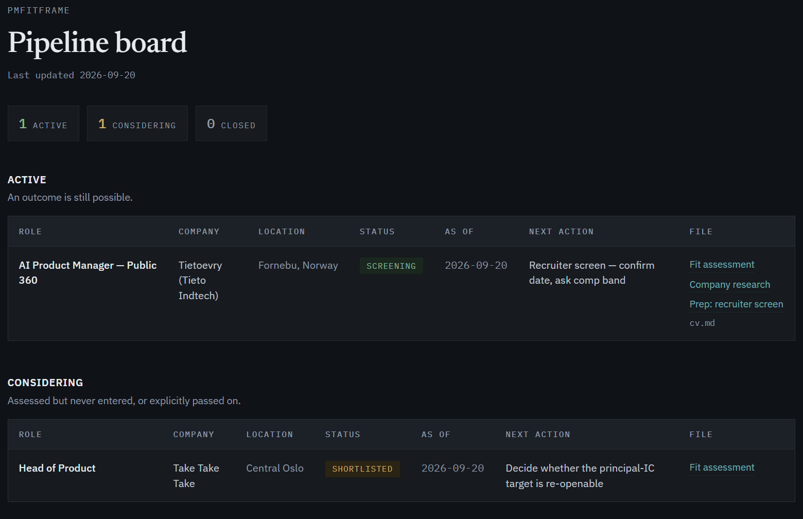
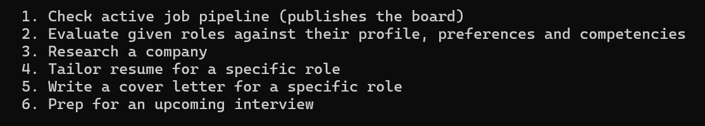
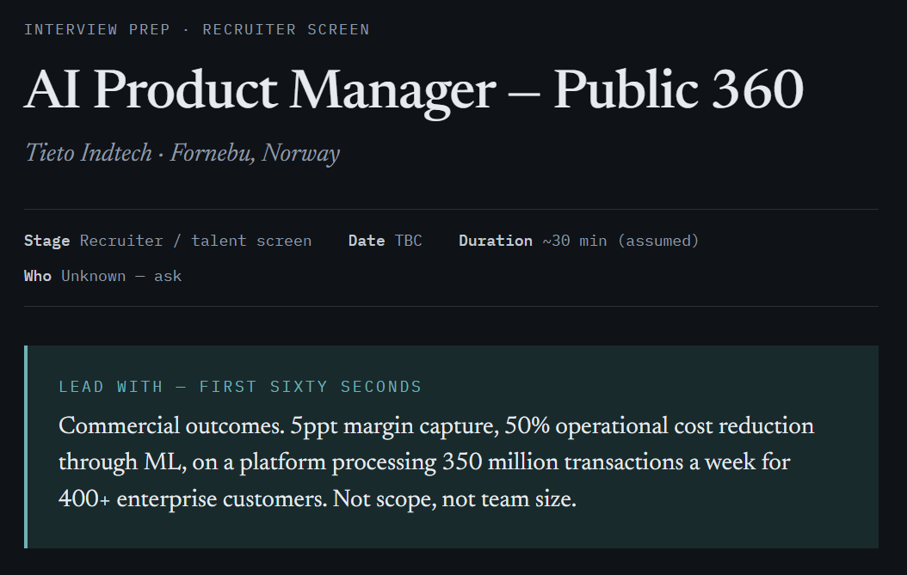
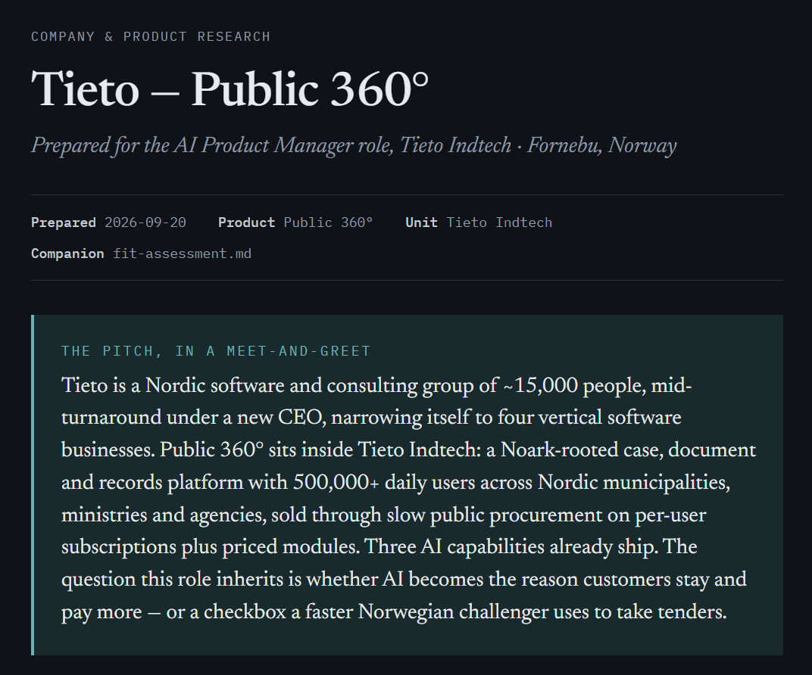

# PMFitFrame

A Claude Code project that runs a technical job search end to end: it reads your CV once, screens roles against what you actually said you want, writes the assessment, tailors the CV, drafts the letter, preps the interview, and keeps a pipeline board you can share as a link.

It is not a chatbot that gives job search advice. It is a set of skills with hard rules, a state directory on disk, and a strong bias against telling you what you want to hear.

<!-- SCREENSHOT: the pipeline board artifact, full page -->


---

## Why this exists

Generic AI job search help fails in three predictable ways. It flatters. It forgets. And it invents.

This project is built to fail differently:

| Failure mode | What stops it here |
| --- | --- |
| Flattery | Every fit assessment carries an **Honest Gap Assessment** table and a verdict that is allowed to be "do not apply". A stated hard requirement you do not meet ends the assessment cleanly rather than getting talked around. |
| Forgetting | `pm-profile/` is the source of truth about you; `job-pipeline/` is the working state. Both live on disk. Every skill reads them fresh rather than trusting the conversation. |
| Inventing | `tailor-resume` and `cover-letter` may reorder, reframe and drop. They may not add. If the posting wants something your CV does not show, you get asked, not written around. |

---

## Quick start

1. **Get Claude Code.** This repo is a Claude Code project, not a standalone tool.
2. **Clone it and open a session in the project root.**
   ```bash
   git clone <this-repo> PMFitFrame
   cd PMFitFrame
   claude
   ```
3. **Start the conversation.** Say anything — `hi`, a question, or jump straight to sharing a CV. This triggers the boot protocol, which shows you the welcome line if no CV is on file, or the menu if one exists.
4. **Give it your CV.** A path, an attachment, or pasted text. PDF, DOCX, DOC, Pages, RTF, TXT or MD all work.
   ```
   > C:\path\to\my_resume.pdf
   ```
   It extracts the text, saves `pm-profile/cv.md` plus the original, and tells you where both landed.
5. **Paste a job description.** You get a fit assessment, a published page, and a pipeline entry.

That is the whole onboarding. Everything else is optional depth.

<!-- SCREENSHOT: first session — the welcome line, then the CV intake summary -->


---

## How a session starts

A `SessionStart` hook (`.claude/boot.sh`) checks `pm-profile/` in shell **before** Claude answers anything, and injects the result into context. The branch is decided by code, not by model judgement, so the first response is deterministic:

- **No CV on file** → you get one line asking for a CV, and nothing else. No menu, no skills, no advice on a profile that does not exist.
- **CV on file** → you get what is on file by filename, one line on anything missing and why it would help, then the menu.

```
1. Check active job pipeline (publishes the board)
2. Evaluate given roles against their profile, preferences and competencies
3. Research a company
4. Tailor resume for a specific role
5. Write a cover letter for a specific role
6. Prep for an upcoming interview
```

A bare number is a selection. So is "where do things stand", "should I apply to this", or a pasted posting.

---

## The skills

Eight skills in `.claude/skills/`. Six are menu options; `cv-intake` fires whenever you supply a CV, and `pipeline-artifacts` is invoked by the others.

| Skill | Triggered by | What it produces |
| --- | --- | --- |
| **cv-intake** | Supplying a CV in any form | `pm-profile/cv.md` (canonical text), `cv-original.<ext>` (verbatim), and `level.md` (your `<level-slug>`, deduced from titles and described scope). Sanity-checks the extraction before saving, so a silently mangled PDF cannot poison everything downstream. |
| **job-pipeline** | `1`, "where do things stand", or news on a role | The index and role files under `job-pipeline/`. Owns one status vocabulary, and derives the table from the status so a rejected role cannot sit in Active. |
| **role-fit** | `2`, a pasted posting, "should I apply" | `fit-assessment.md`: role deconstruction, preference screen, dimension-by-dimension fit, honest gaps, bridging language, verdict. The foundation document every other skill reads first. |
| **company-research** | `3`, "research this company" | `company-product-analysis.md`: product, market, competitors, business model, org signals. Enough to answer "tell me about our product" in an interview. |
| **tailor-resume** | `4`, "tailor my CV" | `cv.md` in the company folder. Reorders and reframes. Never invents. |
| **interview-prep** | `6`, "mock interview" | Mode A: a calibrated prep doc per stage, published as its own page. Mode B: a live turn-by-turn mock where you answer and get graded against a senior bar. |
| **cover-letter** | `5`, "write the cover letter" | `cover-letter.md`, five-part structure, gaps named directly rather than buried. |
| **pipeline-artifacts** | Another skill needing a refresh | The published pages: one per role document, plus the board that links them all. |

### What the skills refuse to do

- `role-fit` will not soften a stated hard requirement into a maybe because the rest of the fit is strong.
- `tailor-resume` will not change a metric, obscure an employer, or claim domain experience you do not have.
- `cover-letter` will not imply a listed requirement is met when it is not.
- Nothing prints pipeline state into the terminal. The board is the only view of it, and if publishing fails you are told it failed rather than handed a retyped table.

---

## A real end-to-end flow

What using this actually looks like, in order:

```
paste a Clojure role          → verdict: do not apply. No AI/ML in scope (your stated
                                 deal-breaker) and no functional-JVM experience against a
                                 hard requirement. Closed, with the reasoning kept.

paste an AI engineering role   → verdict: apply, but in this order — ask for the salary
                                 range before building the demo they require, because the
                                 demo costs two weeks and comp is the one gap effort
                                 cannot close.

"adjust my cv and write the    → tailored CV, letter, and the range email. The letter's
 cover letter"                   claim about a demo you had not built yet gets removed,
                                 with a note saying what to add once it exists.

"I sent the range email"       → status advances, board refreshes.

"they can meet my expectations,→ assessment updated (and the wrong call in it named as
 HR chat soon"                   wrong), prep doc written and published, status to
                                 Screening.

"run the mock interview"       → one question at a time, graded, rebuilt in your voice.
```

The through-line: it sequences work by cost, tells you when your own stated preferences rule something out, and records what it got wrong instead of quietly editing history.

<!-- SCREENSHOT: a fit assessment artifact, showing the verdict block and the gap table -->


<!-- SCREENSHOT: an interview prep page on a phone-width viewport -->


---

## Published pages

Documents on disk are markdown. Anything you would actually read away from the terminal is also published as a Claude Artifact:

- **The pipeline board** — three tables (Active, Considering, Closed), your screening criteria, and every role document linked in the File column. One stable URL that updates in place.
- **A page per fit assessment** — re-assessing a role updates that same page.
- **A page per interview stage** — the prep sheet, designed to be read on a phone ten minutes before the call.

URLs are tracked in `*-artifact-url.txt` siblings next to each document, so nothing multiplies links.

---

## Directory layout

```
pm-profile/                     you — slow-changing, read-mostly, gitignored
├── cv.md                       canonical CV text. Every skill reads this.
├── cv-original.<ext>           the file you supplied, verbatim
├── competencies.md             self-rated pillars + calibration notes
├── preferences.md              comp floor, role shape, deal-breakers, screening rules
└── level.md                    <level-slug>: the level deduced from the CV, plus your target

job-pipeline/                   working state — owned by the assistant, gitignored
├── overview.md                 the index: three tables, one status vocabulary
├── strategy.md                 optional: the current read on what's working
└── applications/<company>/     one folder per company
    ├── <role-slug>.md          role file: JD verbatim, status, history
    ├── fit-assessment.md
    ├── company-product-analysis.md
    ├── cv.md                   tailored
    ├── cover-letter.md
    ├── interview-prep-<stage>.md
    └── *-artifact-url.txt      published page URLs

.claude/
├── boot.sh                     SessionStart hook: the profile check, in shell
├── settings.json               permissions and hooks
├── statusline.sh               optional status line
└── skills/                     the eight skills
```

### Your data stays local

`pm-profile/` and `job-pipeline/` are both in `.gitignore`. Your CV, your salary floor, your honest gaps and your live applications are never committed. Clone the repo and you get the machinery, not somebody's job search.

---

## How the rules are enforced

Three layers, deliberately overlapping:

**1. `CLAUDE.md` hard rules.** No git. No directory exploration. No recap unless asked. No preamble. Never write to `pm-profile/` without showing you first (CV intake excepted, because it reports paths instead). Never print the pipeline into the conversation.

**2. `settings.json` permissions.** The rules that matter are also enforced mechanically, not left to good intentions:

```json
"deny": ["Bash(git:*)", "Bash(gh:*)", "Bash(rg:*)", "Bash(tree:*)",
         "Read(./.git/**)", "Read(./.github/**)", "Glob", "Grep"]
```

Reads and writes to `pm-profile/` and `job-pipeline/` are pre-allowed, so the work does not stall on permission prompts.

**3. The `SessionStart` hook.** Onboarding state is computed by code. The model cannot decide it is "probably fine" to show the menu to someone with no CV on file.

---

## Requirements

| Thing | Why | Notes |
| --- | --- | --- |
| Claude Code | The whole project is skills + hooks + CLAUDE.md | Any recent version |
| bash | `boot.sh` and `statusline.sh` | Git Bash is fine on Windows |
| A PDF text extractor | CV intake from PDF | `pdftotext` (poppler) or Python `pypdf`. The `cv-intake` skill's table lists macOS `textutil` for DOC/DOCX/RTF, which does not exist on Windows or Linux — those formats need LibreOffice or `pandoc` there. |
| `jq` | Only for `statusline.sh` | Without it the status line silently does nothing. Everything else works. |

---

## Extending it

**Add a skill.** Create `.claude/skills/<name>/SKILL.md` with frontmatter (`name`, `description` with trigger phrases), then add a row to the table in `CLAUDE.md` so it gets invoked rather than improvised.

**Give a skill reference material.** `interview-prep/docs/` holds books extracted to markdown with `<!-- page N -->` markers so the skill can cite a page. Drop a PDF in and ask for it to be extracted.

**Change what gets screened.** Edit `pm-profile/preferences.md`. The **Screening rules** section is applied mechanically in every assessment, so changing a rule there changes every future verdict. Tell the assistant afterwards, since a changed deal-breaker can invalidate a verdict already on the board.

**Correct your level.** `pm-profile/level.md` holds one slug from a fixed vocabulary (`senior-ic`, `staff-ic`, `tech-lead`, `eng-manager`, …), deduced from your CV, plus the target level you are aiming at. `role-fit` compares every posting's implied level against it and flags under-levelled roles and stretches; `interview-prep` holds its grading bar there. Edit the file if the deduction is wrong, and the correction propagates everywhere.

**Recalibrate how claims are weighted.** `pm-profile/competencies.md` holds self-rated pillars plus calibration notes, for example "lead with inference and serving, not reliability". Assessments obey those notes.

---

## Honest notes

- **The artifacts are the interface.** Pipeline state is deliberately unavailable in the terminal. If that sounds annoying, it is the point: a retyped table in scrollback goes stale the moment anything changes.
- **A cover letter is a cold-channel tool.** Where a warm introduction exists, the letter is the weaker path and the skill says so rather than overselling itself.
- **Prep docs cite the book, not memory.** Interview questions and frameworks come from the extracted references in `interview-prep/docs/` with page numbers, so you can check them.
- **A narrow profile produces a thin pipeline.** If your preferences encode a hard comp floor and a domain requirement, most roles will be screened out, and the board will look empty. That is the filter working, not the assistant idling.

---

## Screenshots to add

Drop images at these paths and the README picks them up:

| Path | What to capture |
| --- | --- |
| `docs/screenshots/01-pipeline-board.png` | The pipeline board artifact, full page |
| `docs/screenshots/02-first-session.png` | A fresh session: welcome line, then the CV intake summary |
| `docs/screenshots/03-fit-assessment.png` | A fit assessment page: verdict block and gap table |
| `docs/screenshots/04-interview-prep.png` | A prep page at phone width |
| `docs/screenshots/05-mock-interview.png` | The live mock: a question, an answer, the grading |
